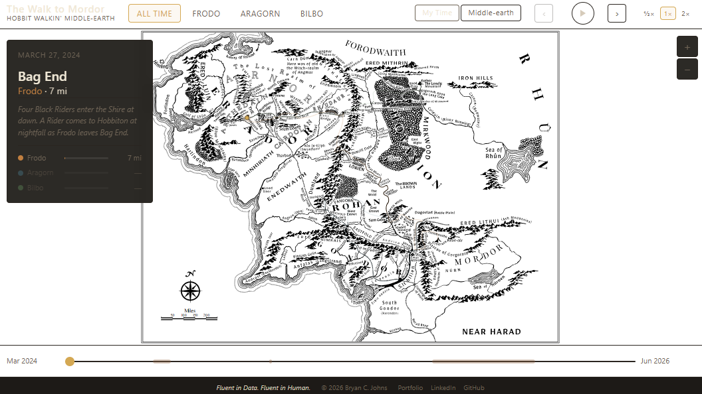
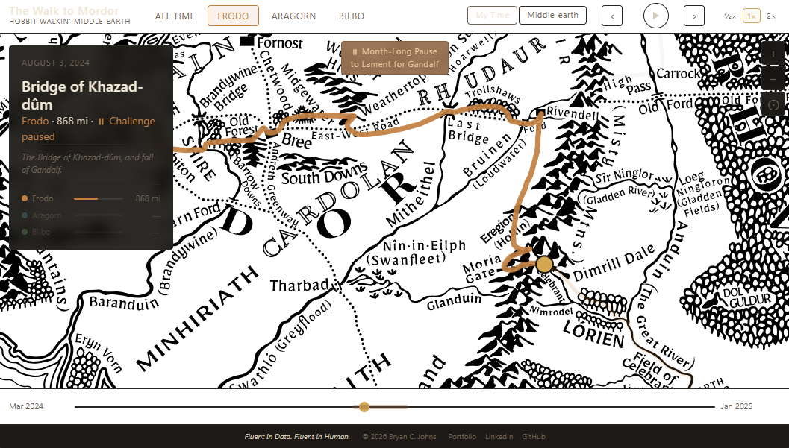
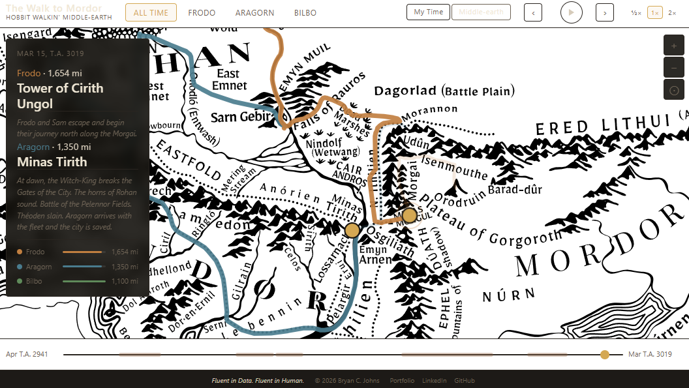
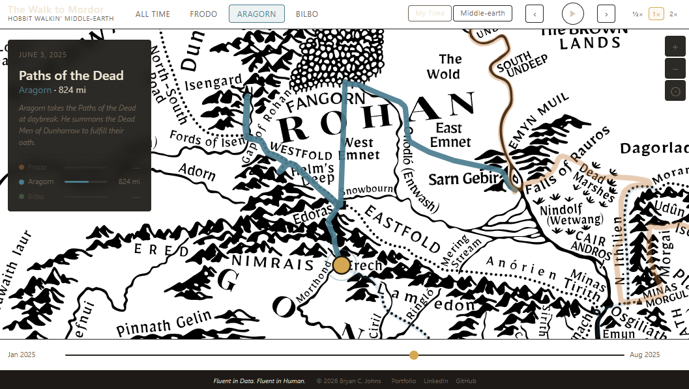
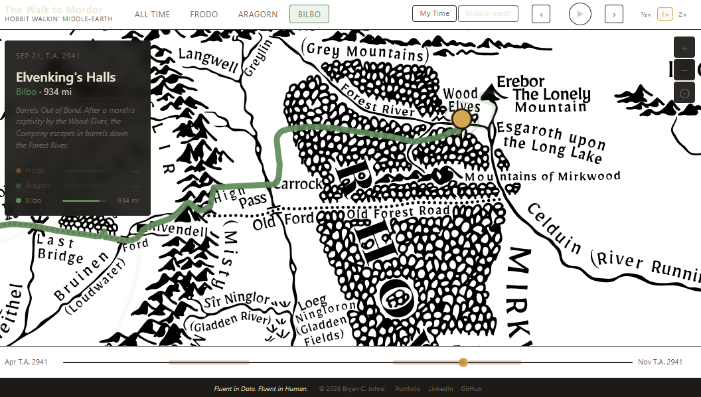
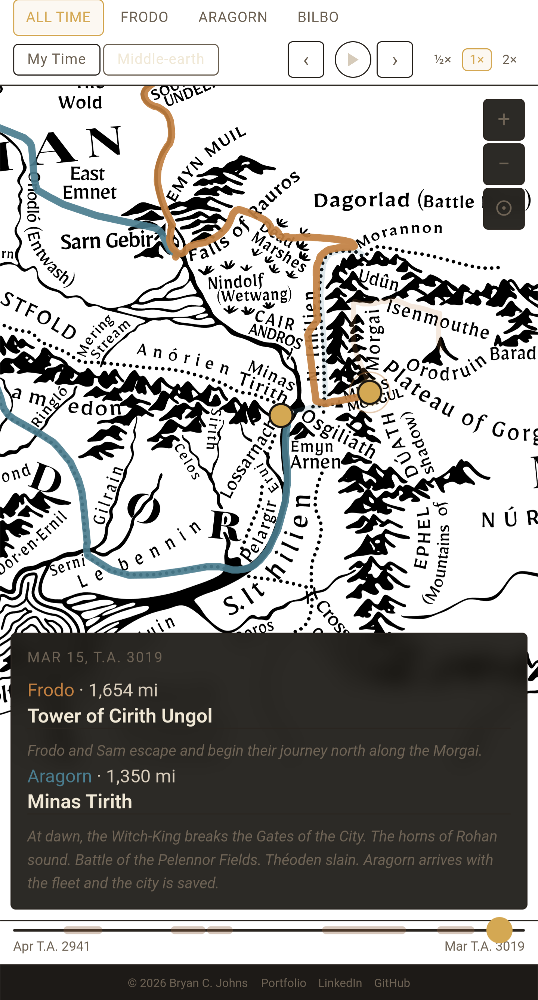
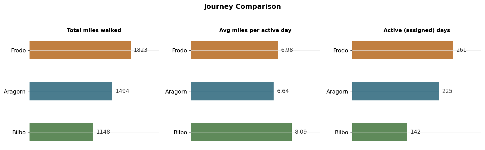
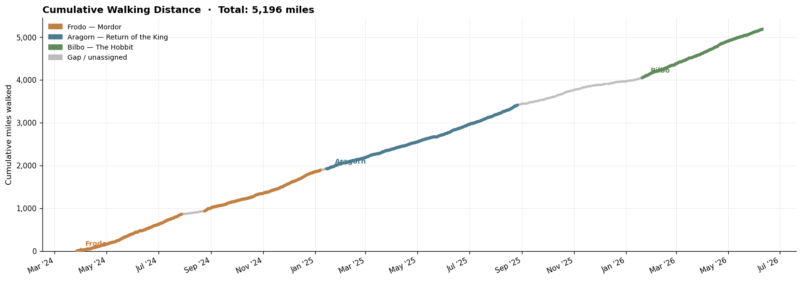

# The Walk to Mordor

*Three journeys. One walker. Two clocks.*

An interactive data-storytelling project that maps real-world walking data onto three fictional journeys through Middle-earth: Bilbo's adventure in *The Hobbit*, Frodo's arduous trek to Mordor, and Aragorn's path to *The Return of the King*.

🔗 [Live Visualization](https://johbry17.github.io/walk-to-mordor/)

I completed all three as virtual walking challenges through [The Conqueror](https://www.theconqueror.events/), logging steps with Google Fit from March 2024 through June 2026. The visualization turns that walking history into something you can explore — advancing through real-world dates, or advancing through Tolkien's.

## The Three Journeys

| Journey | Character | Walking Period | Target | Miles Walked | Days Active |
|---|---|---|---|---|---|
| The Walk to Mordor | Frodo | Mar 2024 – Jan 2025 | 1,815 mi | 1,823 mi | 261 |
| Return of the King | Aragorn | Jan 2025 – Aug 2025 | 1,482 mi | 1,494 mi | 225 |
| The Hobbit | Bilbo | Jan 2026 – Jun 2026 | 1,100 mi | 1,148 mi | 142 |

All three exceeded their Conqueror targets. Across the full project window: 5,196 miles walked over 806 days.

## Two Clocks

The central design problem was representing two independent timelines — mine and Tolkien's — that produce the same map output.

**My Time** advances through real-world calendar dates (March 2024 – June 2026). Each day's actual walking distance pushes the fictional position forward along the route. When I walked more, the character moved faster.

**Middle-earth Time** advances through the Shire Calendar (T.A. 2941 for Bilbo; T.A. 3018–3019 for Frodo and Aragorn). Character position is interpolated across the known Tolkien chronology, entirely independent of my real walking pace. In this mode, Frodo and Aragorn's journeys overlap chronologically: both are active on screen through the final weeks of T.A. 3019.

Both clocks resolve to the same output — a `{ journey_id, cumulative_miles }` pair — which `map.js` converts to an SVG position. The renderer is clock-agnostic.

## Data Architecture

Four separate systems feed the visualization. They are deliberately kept distinct:

```
walking.csv            → real dates, actual daily miles, journey assignment
                         (806 rows; includes gap days between challenges)

me-time-anchors.csv    → human-curated: Shire dates, mileage anchors, confidence
                         ↓ (me-time-generator.ipynb)
me_time.csv            → continuous daily Middle-earth timeline (generated)

chronology.json        → narrative events: Shire date + mileage anchor + text
                         (used by both clocks independently)

routes.json            → SVG geometry (dense point arrays) + mileage calibration
                         anchors linking fictional miles to geometry indices
```

Real mileage ≠ fictional mileage. Fictional mileage ≠ visual path length. Narrative events are keyed independently to both clock systems.

## Technical Challenges

### The Shire Calendar

Python's `datetime` module does not work for Tolkien's calendar. Every month has 30 days, and special intercalary days exist: 1 Lithe, Midyear's Day, 2 Lithe, Yule 1, Yule 2, and Overlithe in leap years (year divisible by 4).

`notebooks/me-time-generator.ipynb` implements a custom Shire Calendar from scratch, including an absolute ordinal system anchored to T.A. 2941 Yule 2. Within-year ordinals follow this structure:

| Days | Ordinals (non-leap) |
|---|---|
| Months 1–6 (30 days each) | 1–180 |
| 1 Lithe | 181 |
| Midyear's Day | 182 |
| 2 Lithe | 183 |
| Months 7–12 (30 days each) | 184–363 |
| Yule 1 | 364 |

Leap years insert Overlithe at ordinal 183, shifting everything after it by one. Named special days (like "Midyear's Day" or "1 Lithe") are stored as date strings and converted to ordinals during preprocessing. The Middle-earth Time slider navigates by these ordinal integers — interpolation, range arithmetic, and mode filtering all depend on the ordinal representation being reliable.

### Reconstructing Middle-earth Movement

The Conqueror provides journey mileage totals and named segment milestones. Tolkien's text and appendices provide dated narrative events. Neither provides a continuous daily mileage record.

`me-time-anchors.csv` bridges the gap: each row records a Shire Calendar date, a cumulative mileage value, a place name, and a confidence level (`high` for dates established in the text, `estimated` for reasoned interpolations). Between anchors, mileage is distributed linearly across the relevant Middle-earth days. Recognized rest stops — Rivendell, Lothlórien, the Wood-elves' halls — produce zero-movement intervals in the output.

The result is a modeled approximation of movement through Tolkien's chronology. It is not a claim about canonical travel distances.

### Visual Route vs. Fictional Mileage

The SVG geometry in `routes.json` was hand-traced over the Middle-earth map using a custom interactive tool (see `archive/tools/`). Each journey has two layers: a dense array of `{x, y}` geometry points tracing every bend of the path, and a sparse array of calibration anchors that link named locations and their fictional mileage values to specific geometry indices.

The `_resolve()` function in `map.js` converts fictional cumulative miles to an SVG position: find the two calibration anchors bracketing the current mileage, interpolate a target arc length along the dense geometry, then walk the geometry points to find the exact sub-segment. The marker follows every curve of the traced path, not a straight line between anchors. `stroke-dashoffset` reveals the completed route progressively as the marker advances.

This means the visual route is an interpretive geographic rendering. Mileage does not equal SVG path length, and path positions are visual estimates on a fan-made map.

### Route Builder

The dense route geometry does not exist in any published form. I built a custom tool to create it: `archive/tools/route-builder.html`, a single-file interactive application that lets you trace a route over the Middle-earth map by clicking, assign mileage anchors to specific geometry points, and export `routes.json`. It supports zoom/pan, anchor index validation, multi-journey session continuity, and unsaved-change warnings. All three routes were traced over multiple sessions with this tool.

## Gallery


*Default view: All journeys, My Time. Frodo has just left Bag End on March 27, 2024.*


*Frodo's journey in My Time: passing the Bridge of Khazad-dûm. The badge marks a challenge rest period mapped to the lament for Gandalf.*


*All Time view in Middle-earth Time: T.A. 3019. Frodo and Aragorn simultaneously active; the info panel shows concurrent narrative events.*


*Aragorn filtered solo: June 2025, Paths of the Dead. The revealed route shows the complete path walked so far.*


*Bilbo in Middle-earth Time: T.A. 2941, escaping the Wood-elves. The timeline shows Middle-earth Calendar dates.*


*Responsive mobile layout: the map fills the viewport with the info panel positioned below.*


*Three challenges compared: total miles, average daily pace, and active days.*


*5,196 miles across the full project window. Grey segments are gap days between challenges.*

## Repository Structure

```
data/
  conqueror.csv            — challenge metadata and segment boundaries from The Conqueror
  me-time-anchors.csv      — human-curated Shire date / mileage anchors (source of truth)
  processed/
    daily_steps.csv        — processed Google Fit data (806 days; intermediate)
    journeys.csv           — journey segment table (intermediate)

docs/                      — GitHub Pages root
  index.html               — redirect to static/
  static/
    index.html             — main application
    css/styles.css
    js/
      app.js               — data loading, clock logic, info panel rendering
      map.js               — SVG route rendering and _resolve()
      timeline.js          — slider, playback, mode switching
      pan-zoom.js          — map zoom/pan (mouse, touch, pinch)
    data/
      walking.csv          — real walking data (public-safe; 806 rows)
      me_time.csv          — generated Middle-earth timeline
      chronology.json      — narrative events (location, Shire date, text)
      journeys.json        — journey segment metadata
      routes.json          — SVG geometry and mileage calibration anchors
    assets/
      preview-mapome-slim.svg  — Middle-earth base map (CC BY-SA 4.0)

notebooks/
  etl.ipynb                — raw Google Fit export → data/processed/
  me-time-generator.ipynb  — Shire Calendar implementation + me_time.csv generation
  eda_walk_to_mordor.ipynb — exploratory analysis of personal walking data
  wtm_theme.py             — shared matplotlib palette and theme

archive/
  proof_of_concept/        — early SVG overlay prototype
  tools/
    route-builder.html     — interactive route geometry tracing tool
    route-builder.js
    README.md              — tool documentation
  map/                     — mapome source files (Affinity Designer)
    README.md
    LICENSE.txt            — CC BY-SA 4.0

resources/
  images/                  — screenshots and EDA plots
  conqueror_images/        — Conqueror completion certificates (personal records)

raw_data/                  — gitignored; original Google Fit export
```

## Running Locally

The visualization has no build step and no dependencies.

```bash
git clone https://github.com/johbry17/walk-to-mordor.git
cd walk-to-mordor
python -m http.server 8000
# Open http://localhost:8000/docs/static/
```

To re-run the analysis notebooks:

```bash
pip install pandas numpy matplotlib jupyterlab
```

Run in order:
1. `notebooks/etl.ipynb` — produces `data/processed/`
2. `notebooks/me-time-generator.ipynb` — produces `docs/static/data/me_time.csv`
3. `notebooks/eda_walk_to_mordor.ipynb` — exploratory analysis (no outputs written)

The route builder also requires being served from the project root:

```bash
# http://localhost:8000/archive/tools/route-builder.html
```

## Limitations

- **Fictional distances are modeled.** Mileage between known anchor locations is distributed linearly across the relevant Shire Calendar days. The result approximates movement through Tolkien's chronology; it does not claim to replicate actual travel distances.
- **The map is interpretive.** Route positions were hand-traced on a fan-made Middle-earth map. Geographic accuracy is not guaranteed. The visual route is an interpretation, not a scholarly reconstruction.
- **Mileage anchor confidence varies.** The `me-time-anchors.csv` source marks each anchor as `high` (established in Tolkien's text or appendices) or `estimated` (reasoned approximation). Estimated anchors introduce uncertainty in the Middle-earth Time model.
- **The Conqueror provides the mileage framework.** Journey distances and segment structures follow The Conqueror virtual challenge. They are not derived from independent Tolkien scholarship.

## Attribution and Legal Notes

**Middle-earth map:** `preview-mapome-slim.svg` is from [mapome](https://github.com/k1tesurfen/mapome) by k1tesurfen, licensed [CC BY-SA 4.0](https://creativecommons.org/licenses/by-sa/4.0/). Source files are archived in `archive/map/`.

**Tolkien's works:** The fictional characters, place names, chronology, and narrative events referenced in this project are drawn from *The Hobbit* and *The Lord of the Rings* by J.R.R. Tolkien (and associated appendices), published by HarperCollins/Houghton Mifflin Harcourt. This project is non-commercial and is not affiliated with the Tolkien Estate, HarperCollins, or any rights holder. No claim is made to any intellectual property associated with Middle-earth.

**The Conqueror:** Journey mileage framework and challenge structure from [The Conqueror](https://www.theconqueror.events/). The completion certificates in `resources/conqueror_images/` are personal records. No affiliation with The Conqueror is implied or claimed.

**Walking data:** Personal Google Fit export. Raw data is gitignored and not published.

> ⚠️ **Note:** The project brief mentions Karen Wynn Fonstad's *Atlas of Middle-earth* as a possible secondary reference. The repository files reference Tolkien's text and *Unfinished Tales* but do not explicitly cite Fonstad. Please confirm whether this source was consulted before finalizing attribution.

## License

MIT License © 2026 Bryan Johns. See [LICENSE](LICENSE) for details.

This license applies to the original code only. The Middle-earth map (mapome) carries a separate CC BY-SA 4.0 license. Tolkien's fictional content is not covered by either license.

## Author

Bryan Johns, 2026  
[bryan.johns@informedwanderer.com](mailto:bryan.johns@informedwanderer.com) | [LinkedIn](https://www.linkedin.com/in/b-johns/) | [GitHub](https://github.com/johbry17) | [Portfolio](https://informedwanderer.com)  
— Fluent in Data. Fluent in Human.
