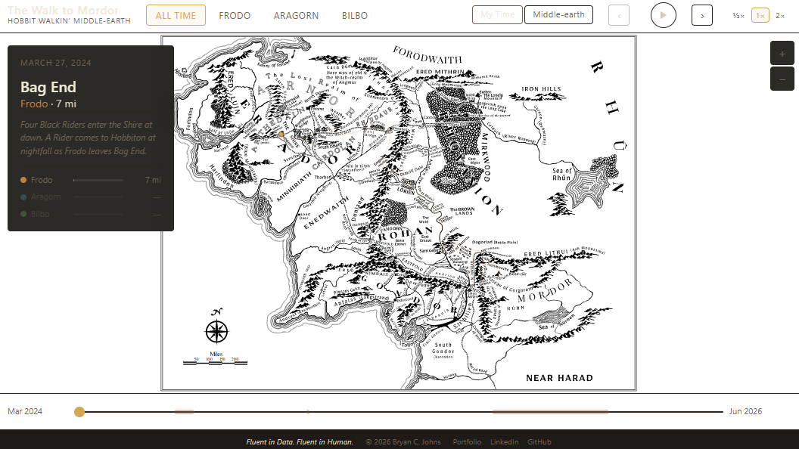
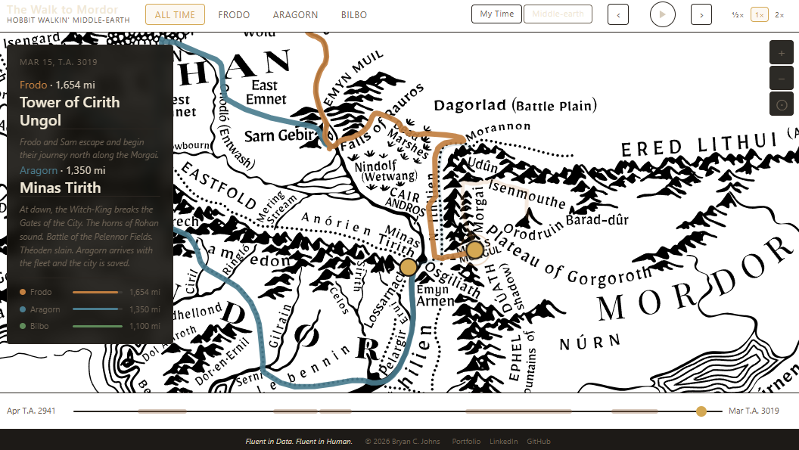
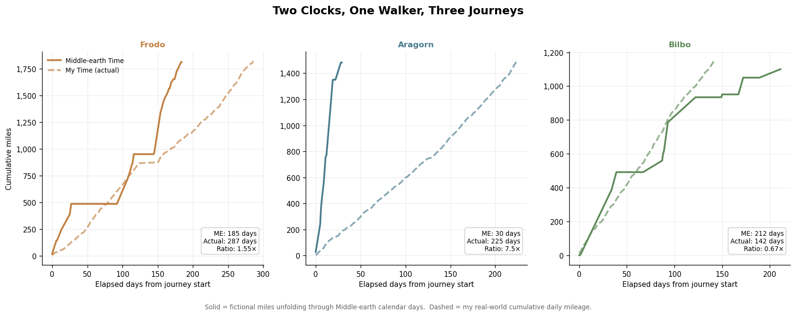
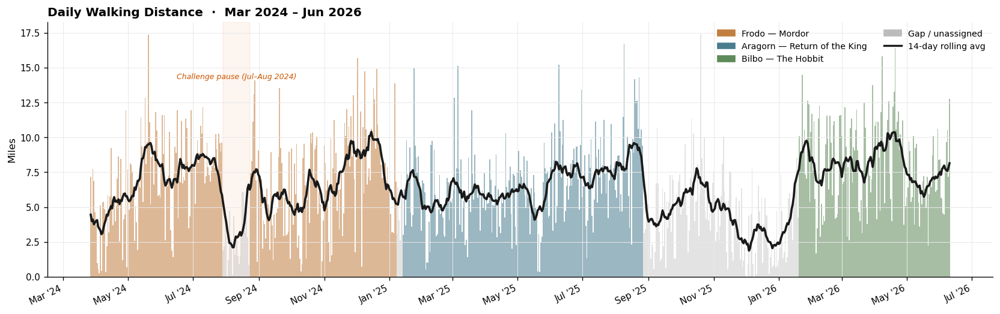
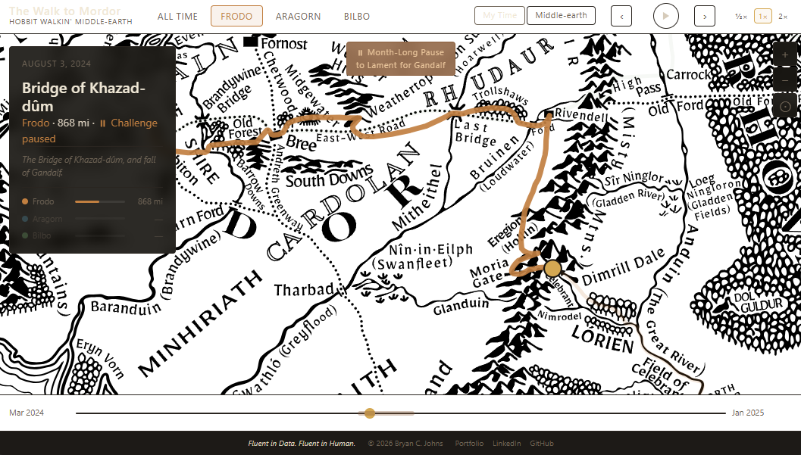
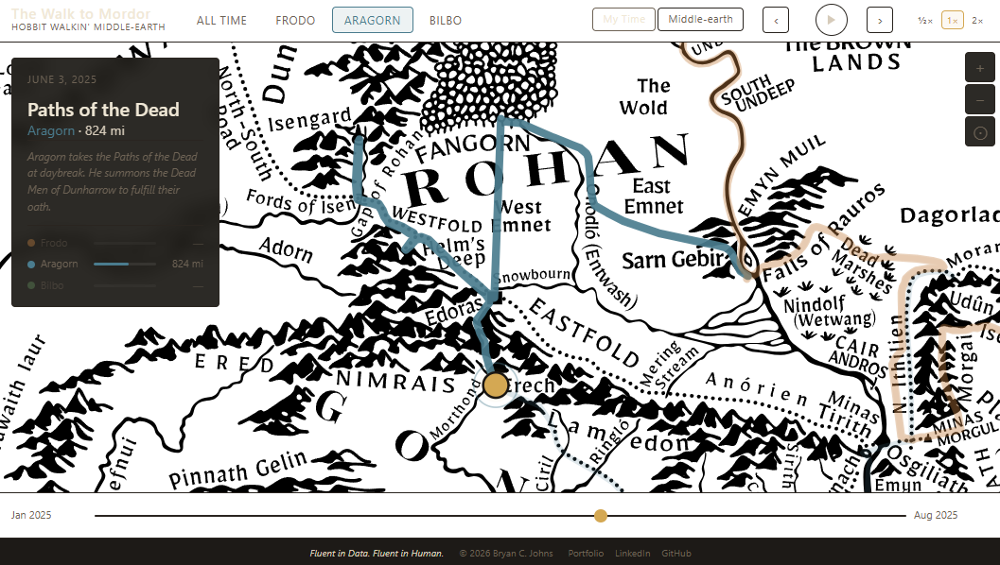
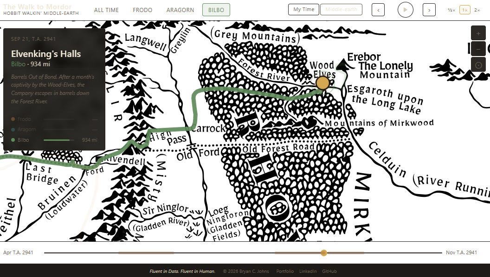
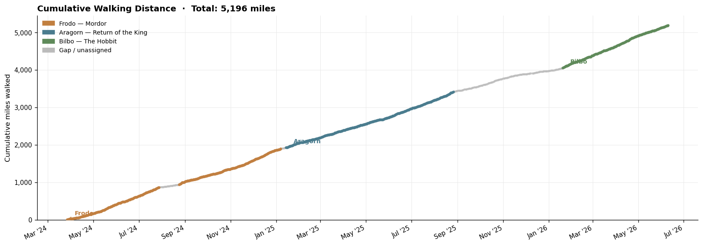
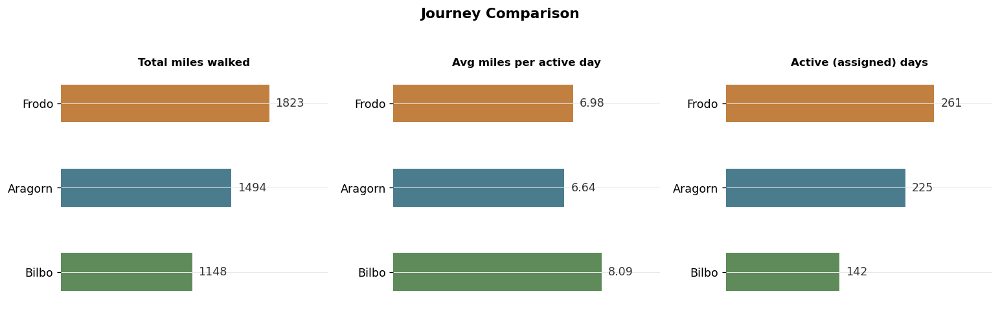
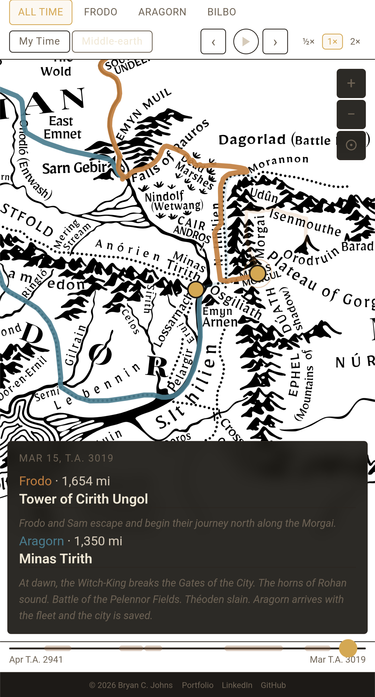

# The Walk to Mordor

### *Three journeys. One walker. Two clocks.*  

An interactive data-storytelling project mapping two years of real-world walking onto three fictional journeys through Middle-earth. Explore the same journeys through two timelines: the dates I actually walked and the dates Tolkien's characters did.

🔗 [Live Visualization](https://johbry17.github.io/Walk-to-Mordor/)  
📖 [About the Project](https://johbry17.github.io/Walk-to-Mordor/static/about)

## Table of Contents

- [Project Overview](#project-overview)
  - [The Three Journeys](#the-three-journeys)
  - [Two Clocks](#two-clocks)
  - [Data Architecture](#data-architecture)
- [Key Findings](#key-findings)
- [Features](#features)
- [Tools & Technologies](#tools--technologies)
- [Technical Challenges](#technical-challenges)
  - [The Shire Calendar](#the-shire-calendar)
  - [Reconstructing Middle-earth Movement](#reconstructing-middle-earth-movement)
  - [Visual Route vs. Fictional Mileage](#visual-route-vs-fictional-mileage)
  - [Route Builder](#route-builder)
- [Gallery](#gallery)
- [Usage](#usage)
- [Repository Structure](#repository-structure)
- [Limitations](#limitations)
- [References](#references)
- [Licenses](#licenses)
- [Acknowledgements](#acknowledgements)
- [Author](#author)

## Project Overview

The Walk to Mordor is an interactive data-storytelling project built from two years of personal walking data. Between March 2024 and June 2026, I completed three virtual walking challenges inspired by Tolkien's journeys: Frodo's trek to Mordor, Aragorn's return to Gondor, and Bilbo's adventure to the Lonely Mountain.

Across the full project window, I walked **5,196 miles over 806 calendar days**. The visualization maps that movement onto Middle-earth, allowing users to explore each journey through two independent timelines: **My Time**, based on actual walking dates and distances, and **Middle-earth Time**, based on Tolkien's chronology.

The comparison reveals how the same journeys produce radically different patterns of movement and elapsed time. Aragorn's 1,482-mile journey, for example, spans 225 calendar days in my walking data but just 30 days in the reconstructed Middle-earth timeline.

The central engineering challenge was making both timelines resolve to the same geographic representation while keeping their underlying data and modeling systems independent.

### The Three Journeys

| Journey | Character | Walking Period | Target| Days Active** |
|---|---|---|---|---|
| The Walk to Mordor | Frodo | Mar 2024 – Jan 2025 | 1,815 mi | 261 |
| Return of the King | Aragorn | Jan 2025 – Aug 2025 | 1,482 mi | 225 |
| The Hobbit | Bilbo | Jan 2026 – Jun 2026 | 1,100 mi | 142 |

** *Days Active counts days with recorded walking activity assigned to each challenge. Frodo's challenge included a pause after Moria; the gap between challenges is excluded from these counts.*

All three challenges exceeded their Conqueror targets. I accumulated 4,465 miles over 628 daysactive days, in addition to walking during the gaps between challenges.

### Two Clocks

The central design problem was representing two independent timelines — mine and Tolkien's — that produce the same map output.

**My Time** advances through real-world calendar dates (March 2024 – June 2026). Each day's actual walking distance pushes the fictional position forward along the route. When I walked more, the character moved faster.

This mode represents what actually happened: my recorded walking data determines the character's progress.

**Middle-earth Time** advances through the Shire Calendar (T.A. 2941 for Bilbo; T.A. 3018–3019 for Frodo and Aragorn). Character position is interpolated across the established or reconstructed Tolkien chronology, entirely independent of my real walking pace. In this mode, Frodo and Aragorn's journeys overlap chronologically, allowing both to appear simultaneously during the final weeks of the narrative.

Both clocks resolve to the same output — a `{ journey_id, cumulative_miles }` pair — which `map.js` converts to an SVG position. The renderer is clock-agnostic.

### Data Architecture

Five complementary data sources and outputs feed the visualization. Each has a distinct responsibility:

```
walking.csv            → real dates, actual daily miles, journey assignment
                         (806 rows; includes gap days between challenges)

me-time-anchors.csv    → human-curated: Shire dates, mileage anchors, confidence
                         ↓ (me-time-generator.ipynb)
me_time.csv            → continuous daily Middle-earth timeline (generated)

chronology.json        → narrative events: Shire date + mileage anchor + text
                         (used by both clocks independently)

routes.json            → SVG geometry (dense point arrays) + mileage calibration
                         anchors linking fictional miles to geometry indices
```

The three kinds of distance are not interchangeable. Real mileage ≠ fictional mileage. Fictional mileage ≠ visual path length. Narrative events are associated with the clock-specific information needed to display them, rather than serving as a substitute for the movement model.

## Key Findings

* **The walking habit outlasted the challenges.** Walking continued during gaps between virtual challenges, so the project captures a broader activity pattern than challenge completion alone.
* **The same journey can have radically different timescales.** Aragorn's 1,482-mile journey spans 225 real-world calendar days but just 30 days in the reconstructed Middle-earth timeline.
* **Fictional movement includes long periods of rest.** In the reconstructed chronology, Frodo's mileage remains stationary for 95 of 185 Middle-earth days, including extended stays in Rivendell and Lothlórien.
* **The model distinguishes evidence from interpretation.** Actual walking records, estimated fictional movement, and hand-traced map geometry remain separate, making the assumptions and limitations of each layer explicit.


## Features

The visualization supports:

- **Two timeline modes** — explore the journeys through real-world walking dates or Tolkien's chronology.
- **Journey filtering** — view all three journeys together or isolate Bilbo, Frodo, or Aragorn.
- **Timeline navigation** — scrub through either timeline or move through previous and next steps.
- **Playback** — automatically advance through the journey with adjustable playback speed.
- **Interactive map** — zoom and pan across the Middle-earth map while the route progressively reveals itself.
- **Narrative events** — encounter locations, milestones, and Tolkien-based events as the journeys progress.
- **Responsive layout** — the visualization adapts to smaller screens and mobile devices.

## Tools & Technologies

- **Python** — data processing, ETL, calendar implementation, temporal modeling, and exploratory analysis
- **Pandas / NumPy** — data transformation and analysis
- **Matplotlib** — exploratory data visualization
- **JavaScript** — interactive visualization and application logic
- **SVG** — route rendering and progressive path animation
- **HTML / CSS** — interface and responsive layout
- **GitHub Pages** — hosting
- **Google Fit** — source of personal walking data
- **The Conqueror** — virtual walking challenge framework
- **Tolkien's works and appendices** — fictional chronology and narrative references

The application itself has **no build step** and **no external runtime dependencies**.

## Technical Challenges

### The Shire Calendar

Python's `datetime` module does not work for Tolkien's calendar. Every month has 30 days (e.g., 30 February), and special intercalary days exist: 1 Lithe, Midyear's Day, 2 Lithe, Yule 1, Yule 2, and Overlithe in leap years (year divisible by 4).

`notebooks/me-time-generator.ipynb` implements a custom Shire Calendar from scratch, including an absolute ordinal system anchored to T.A. 2941 Yule 2. The ordinal structure handles standard months and all intercalary days, including Overlithe in leap years — producing reliable integer arithmetic for interpolation, range comparisons, and slider navigation. 

Named special days (like "Midyear's Day" or "1 Lithe") are stored as date strings and converted to ordinals during preprocessing.

### Reconstructing Middle-earth Movement

The central modeling challenge: Tolkien's text gives narrative events with dates; The Conqueror gives total mileage; neither gives a continuous daily record for the other's timeline.

`me-time-anchors.csv` bridges the gap: each row records a Shire Calendar date, a cumulative mileage value, a place name, and a confidence level (`high` for dates established in the text, `estimated` for reasoned interpolations). The anchor file distinguishes dates established by Tolkien's text from reasoned estimates, particularly for *The Hobbit*, where the chronology is less precisely documented. 

Between anchors, mileage is distributed linearly across the relevant Middle-earth days. Recognized rest stops — Rivendell, Lothlórien, the Wood-elves' halls — produce zero-movement intervals in the output. Linear interpolation provides a continuous daily model; it does not imply that a character traveled at a constant rate or that every intermediate position is textually established.

The result is a modeled approximation of movement through Tolkien's chronology. It is not a claim about canonical travel distances.

### Visual Route vs. Fictional Mileage

The SVG geometry in `routes.json` was hand-traced over the Middle-earth map using a custom interactive tool (see `archive/tools/`). 

Each journey has two layers: 

1. A dense array of `{x, y}` geometry points tracing every bend of the path. 
2. A sparse array of calibration anchors that link named locations and their fictional mileage values to specific geometry indices.

The `_resolve()` function in `map.js` converts fictional cumulative miles to an SVG position: 
1. Find the two calibration anchors bracketing the current mileage.
2. Interpolate a target arc length along the dense geometry.
3. Walk the geometry points to find the exact sub-segment and interpolate the marker position. 

The marker follows every curve of the traced path, not a straight line between anchors. `stroke-dashoffset` reveals the completed route progressively as the marker advances.

The visual route is an interpretive geographic rendering. **Mileage does not equal SVG path length, and path positions are visual estimates on a fan-made map.**

### Route Builder

The dense route geometry does not exist in any published form, so I built a custom tool to create it: `archive/tools/route-builder.html`. The single-file interactive application, inspired by [geojson.io](https://geojson.io/), supports zooming and panning, route tracing, mileage-anchor assignment, anchor validation, multi-journey session continuity, and unsaved-change warnings. All three routes were traced over multiple sessions and exported as `routes.json`.

## Gallery


*Default view: Overview, My Time, March 27, 2024. Frodo has just left Bag End.*


*Overview in Middle-earth Time, T.A. 3019. Frodo and Aragorn's journeys overlap during the final weeks of the War of the Ring.*


*The same journeys produce different movement patterns under the two clocks: My Time reflects actual walking, while Middle-earth Time preserves modeled periods of rest and travel.*


*Daily walking distance bar chart, March 2024 – June 2026, colored by journey with 14-day rolling average*


*Frodo's journey in My Time: passing the Bridge of Khazad-dûm. The badge marks a challenge rest period mapped to the lament for Gandalf.*


*Aragorn filtered solo: June 2025, Paths of the Dead. The revealed route shows the complete path walked so far.*


*Bilbo in Middle-earth Time: T.A. 2941, escaping the Wood-elves. The timeline shows Middle-earth Calendar dates.*


*5,196 miles across the full project window. Grey segments represent gap days between challenges.*


*Three challenges compared: total miles, average daily pace, and active days.*


*Responsive mobile layout: the map fills the viewport with the info panel positioned below.*

## Usage

### Running Locally

The interactive visualization is a static HTML, CSS, and JavaScript application with no build step or external runtime dependencies. To serve it locally from the repository root:

```bash
git clone https://github.com/johbry17/walk-to-mordor.git
cd walk-to-mordor
python -m http.server 8000
# Open http://localhost:8000/docs/static/
```

### Re-run the Analysis

Install the notebook dependencies:

```bash
pip install pandas numpy matplotlib jupyterlab
```

Run in order:
1. `notebooks/etl.ipynb` — processes the raw Google Fit export and produces `data/processed/`.
2. `notebooks/me-time-generator.ipynb` — generates `docs/static/data/me_time.csv` from the Middle-earth chronology and mileage anchors.
3. `notebooks/eda_walk_to_mordor.ipynb` and `notebooks/eda_two_clocks.ipynb` — exploratory analysis (no outputs written)

The route builder also requires being served from the project root:

```bash
# http://localhost:8000/archive/tools/route-builder.html
```

## Repository Structure

```
data/
  conqueror.csv            — challenge metadata and segment boundaries from The Conqueror
  me-time-anchors.csv      — human-curated Shire date / mileage anchors (source of truth)
  processed/
    daily_steps.csv        — processed Google Fit data (intermediate)
    journeys.csv           — journey segment table (intermediate)

docs/                      — GitHub Pages root
  index.html               — redirect to static/index.html
  static/
    index.html             — main application
    about.html             — about the project
    eda-walking-data.html  — export of eda_walk_to_mordor.ipynb
    eda-two-clocks.html    — export of eda_two_clocks.ipynb
    css/styles.css
    js/
      app.js               — data loading, clock logic, info panel rendering
      map.js               — SVG route rendering and _resolve()
      timeline.js          — slider, playback, mode switching
      pan-zoom.js          — map zoom/pan (mouse, touch, pinch)
    data/
      walking.csv          — real walking data
      me_time.csv          — generated Middle-earth timeline
      chronology.json      — narrative events (location, Shire date, text)
      journeys.json        — journey segment metadata
      routes.json          — SVG geometry and mileage calibration anchors
    assets/
      preview-mapome-slim.svg  — Middle-earth base map (CC BY-SA 4.0)

notebooks/
  etl.ipynb                — raw Google Fit export → data/processed/
  me-time-generator.ipynb  — Shire Calendar implementation + me_time.csv generation
  eda_walk_to_mordor.ipynb — exploratory analysis of personal walking data
  eda_two_clocks.ipynb     — comparative analysis of real walking data and generated middle-earth data
  wtm_theme.py             — shared matplotlib palette and theme

archive/
  proof_of_concept/        — early SVG overlay prototype
  tools/
    route-builder.html     — interactive route geometry tracing tool
    route-builder.js
    README.md              — route-builder documentation
  map/                     — mapome source files (Affinity Designer)
    README.md
    LICENSE.txt            — CC BY-SA 4.0

resources/
  images/                  — screenshots and EDA plots
  conqueror_images/        — Conqueror completion certificates (personal records)

raw_data/                  — gitignored; original Google Fit export
```

## Limitations

- **Fictional distances are modeled.** Mileage between known anchor locations is distributed linearly across the relevant Shire Calendar days. The result approximates movement through Tolkien's chronology; it does not claim to replicate actual travel distances.
- **The map is interpretive.** Route positions were hand-traced on a fan-made Middle-earth map. Geographic accuracy is not guaranteed. The visual route is an interpretation, not a scholarly reconstruction.
- **Mileage anchor confidence varies.** The `me-time-anchors.csv` source marks each anchor as `high` (established in Tolkien's text or appendices) or `estimated` (reasoned approximation). Estimated anchors introduce uncertainty in the Middle-earth Time model.
- **The Conqueror provides the mileage framework.** Journey distances and segment structures follow The Conqueror virtual challenge. They are not derived from independent Tolkien scholarship.

## References

### Primary Sources  
- Tolkien, J.R.R. *The Hobbit*.
- Tolkien, J.R.R. *The Lord of the Rings*, including the appendices.
- Tolkien, J.R.R. *Unfinished Tales*.
- Fonstad, Karen Wynn. *The Atlas of Middle-earth*. Revised edition.

### Data and Project Sources  
- [The Conqueror](https://www.theconqueror.events/) — virtual walking challenge mileage and segment framework.
- [Google Fit](https://www.google.com/fit/) — source of personal walking data.
- [mapome](https://github.com/k1tesurfen/mapome) — source of the base Middle-earth map used for the visualization.


## Licenses

### Original Code

> MIT License © 2026 Bryan Johns. See [LICENSE](LICENSE) for details.
> 
> The MIT License applies to the original code and project materials created for this repository.

### Middle-earth Map

> `preview-mapome-slim.svg` is derived from [mapome](https://github.com/k1tesurfen/mapome) by k1tesurfen and is licensed under CC BY-SA 4.0.
> 
> The original source files are archived in `archive/map/`.

### Tolkien's Works

> The fictional characters, locations, chronology, and narrative material referenced by this project are drawn from the works of J.R.R. Tolkien and associated appendices, published by HarperCollins and Houghton Mifflin Harcourt.
> 
> This project is non-commercial and is not affiliated with the Tolkien Estate, HarperCollins, Houghton Mifflin Harcourt, or any other rights holder. No claim is made to ownership of intellectual property associated with Middle-earth.

### The Conqueror

> The journey mileage framework and challenge structure are based on [The Conqueror](https://www.theconqueror.events/).
> 
> Completion certificates in `resources/conqueror_images/` are personal records. No affiliation with The Conqueror is implied or claimed.

### Personal Walking Data  

> The walking data originated from my personal Google Fit export. Raw source data is gitignored and is not published in this repository.

## Acknowledgements

This project would not exist without the work of J.R.R. Tolkien and the many scholars, cartographers, and fan communities who have made exploring Middle-earth possible.

Particular thanks to:

- Karen Wynn Fonstad, whose Atlas of Middle-earth was consulted as a secondary reference while reconstructing routes and locations.
- k1tesurfen, creator of [mapome](https://github.com/k1tesurfen/mapome), whose Middle-earth map provides the geographic foundation for the visualization.
- [The Conqueror](https://www.theconqueror.events/), whose virtual walking challenges provided the mileage framework that connected my real-world walking to the fictional journeys.

## Author

Bryan Johns, 2026  
[bryan.johns@informedwanderer.com](mailto:bryan.johns@informedwanderer.com) | [LinkedIn](https://www.linkedin.com/in/b-johns/) | [GitHub](https://github.com/johbry17) | [Portfolio](https://informedwanderer.com)  
— Fluent in Data. Fluent in Human.
